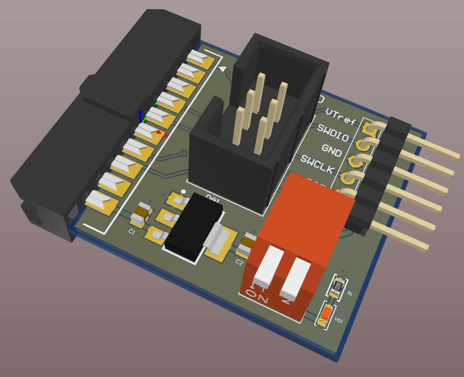
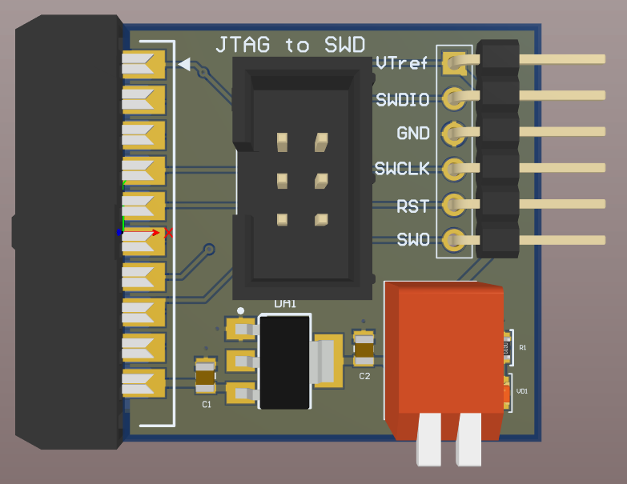
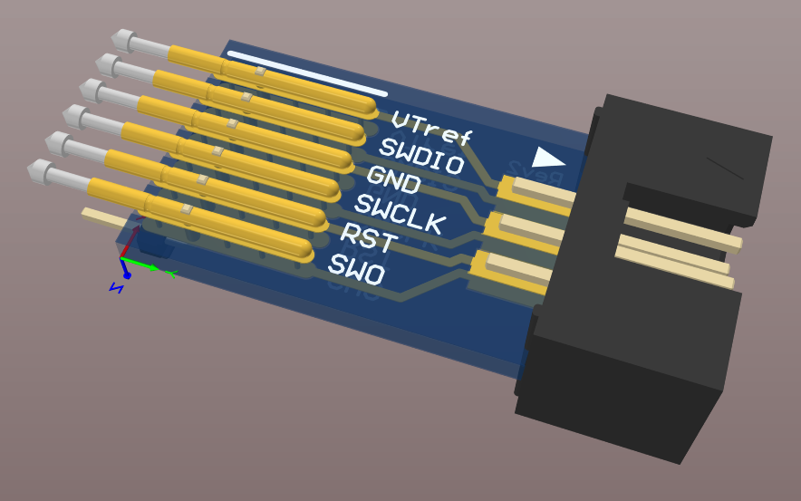
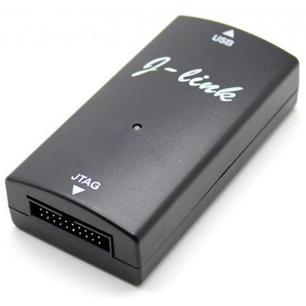

# J-Link_Adapter
This adapter converts 20-pin J-Link interface to 6-pin SWD.

SWD pins plasement is the same as STM32 discovery boards.
This order is safe for reverse mistake connection.

Altium Designer project have two PCBs connected with earch other with 6-pin flat cable:

PCB plug for J-Link debug probe:

PCB for user PCB connection:

J-Link debug probe for use with the adapter:

